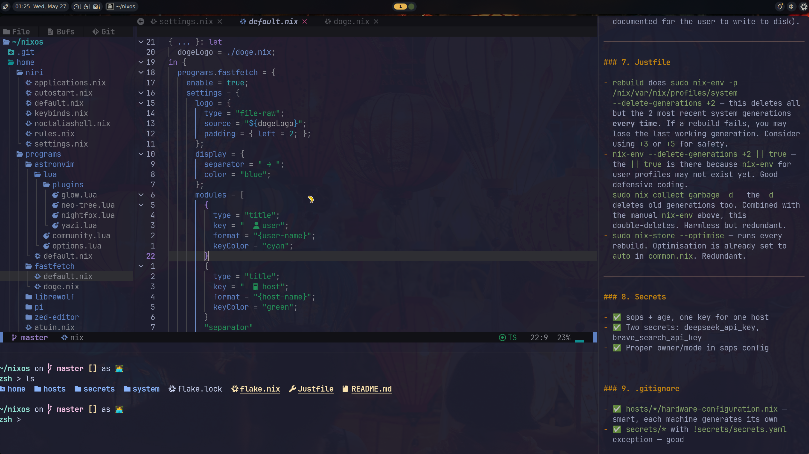

# NixOS dotfiles

X11 stack: **N**ixOS + **C**hadwm + **A**lacritty on VMware Workstation 17 Pro
Also available: Wayland stack (Niri + Noctalia) for 3D-accelerated VMs.



## Hosts

| Host | Desktop | WM | Status |
|------|---------|----|--------|
| `my-vm-x11` | X11 | Chadwm (DWM fork) | **Primary** — lightweight, stable |
| `my-vm` | Wayland | Niri + Noctalia | Secondary — needs 3D acceleration |

## Why X11

- VMware Workstation 17 Pro has limited 3D support → Wayland lags
- X11 + Chadwm is lightweight (great for 4 CPU / 8 GB VM)
- Chadwm provides beautiful bar out-of-the-box (status2d + bar.sh)
- Sxhkd for consistent keybindings (same style as BSPWM)

## VM Settings

| Setting | Value |
|---------|-------|
| Firmware | UEFI |
| 3D Acceleration | OFF (X11) / ON (Wayland) |
| CPUs | 4 |
| RAM | 8 GB |
| Disk | 40 GB |

## Quick Commands

```bash
just rebuild-x11        # build my-vm-x11 (no cleanup)
just rebuild-x11-lite   # build my-vm-x11 (fast, no cleanup)
just rebuild            # build my-vm (wayland)
just update-x11         # pull + build + cleanup + reboot
just upgrade-x11        # flake update + build + cleanup + reboot
just clean              # keep last 2 generations + vacuum
```

## Keybinds (X11 — Chadwm)

| Key | Action |
|-----|--------|
| `Alt+Return` | Terminal (alacritty) |
| `Alt+Space` | Rofi app launcher |
| `Alt+q` | Close window |
| `Alt+f` | Fullscreen |
| `Alt+j/k` | Focus next/previous |
| `Alt+h/l` | Resize master |
| `Alt+1-5` | Switch tag |
| `Alt+Shift+1-5` | Move window to tag |
| `Alt+Space` | Cycle layouts |
| `Alt+Shift+q` | Lock screen (i3lock) |
| `Alt+s` | Screenshot full |
| `Alt+Shift+s` | Screenshot area |
| `Print` | Screenshot |
| `Alt+b` | Toggle bar |
| `Alt+Shift+r` | Restart dwm |
| `XF86Audio*` | Volume, media keys |

## Theme — Stylix (Catppuccin Mocha)

All components automatically themed:
- Chadwm bar (CPU%, MEM, clock)
- Rofi (style-5 with powerline segments)
- Alacritty
- Starship prompt (Catppuccin Powerline format)
- GTK/Qt apps
- Firefox / LibreWolf
- Zellij
- Yazi

## Wallpaper

From [gh0stzk/dotfiles](https://github.com/gh0stzk/dotfiles) — Emilia rice. Available in `system/wallpapers/`.

## Software Stack

| Category | Choice |
|----------|--------|
| Window Manager | Chadwm (DWM fork with gaps, themes, status2d) |
| Display Manager | LightDM (auto-login enabled) |
| Terminal | Alacritty with JetBrainsMono Nerd Font |
| Launcher | Rofi (style-5 centered) |
| Shell | Zsh + Starship prompt |
| Multiplexer | Zellij (minimal, no bars) |
| Editor | Neovim + AstroNvim |
| AI Coding | Pi agent (DeepSeek) |
| Browser | Brave / LibreWolf |
| File Manager | Yazi (terminal) with feh for images |
| Music | MPD + ncmpcpp |
| Notifications | Dunst |
| Compositor | Picom (xrender backend for VMware compat) |
| Secrets | SOPS + age |

## Structure

```
├── flake.nix              ← Inputs, overlays, sharedModules, hosts
├── Justfile               ── rebuild/update shortcuts
├── system/                ── NixOS-level config
│   ├── host-base.nix      ── Boot, network, users, timezone
│   ├── common.nix         ── nix-ld, flakes, GC, updates
│   ├── disk-config.nix    ── Disko partitioning (shared)
│   ├── packages.nix       ── System packages
│   ├── programs/stylix.nix─ Catppuccin Mocha theming
│   ├── services/          ── sops, ssh
│   └── wallpapers/        ── default.jpg, emilia-01.webp
├── desktop/x11/           ── X11 desktop
│   ├── chadwm.nix         ── WM + sxhkd + picom/dunst/bar services
│   ├── system.nix         ── LightDM, X session
│   ├── packages.nix       ── X11 utilities
│   └── home.nix           ── Module imports
├── desktop/wayland/       ── Wayland desktop (Niri + Noctalia)
├── hosts/                 ── Per-machine config
│   ├── my-vm-x11/         ── Primary X11 host
│   └── my-vm/             ── Wayland host
└── home/                  ── User-level (home-manager)
    ├── packages.nix       ── User packages
    └── programs/          ── One file per program
```

## Secrets

Managed with sops-nix. First-time setup:

```bash
age-keygen -o ~/.config/sops/age/keys.txt
sops secrets/secrets.yaml
```
